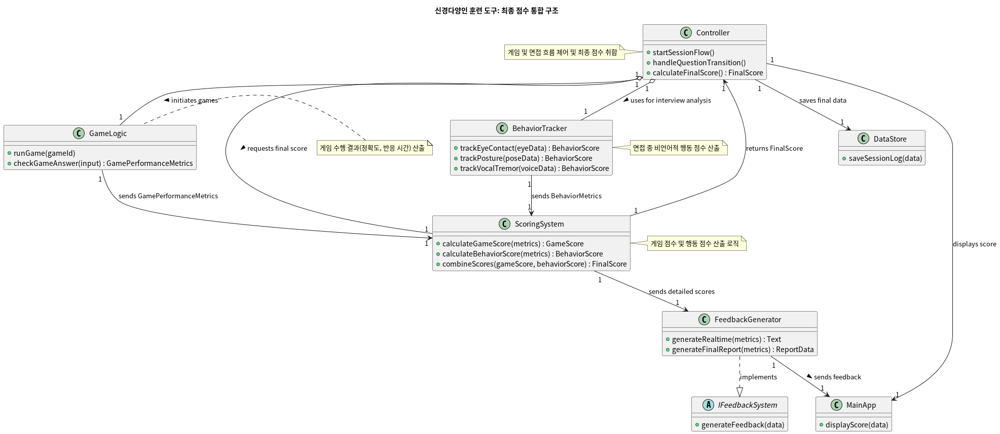
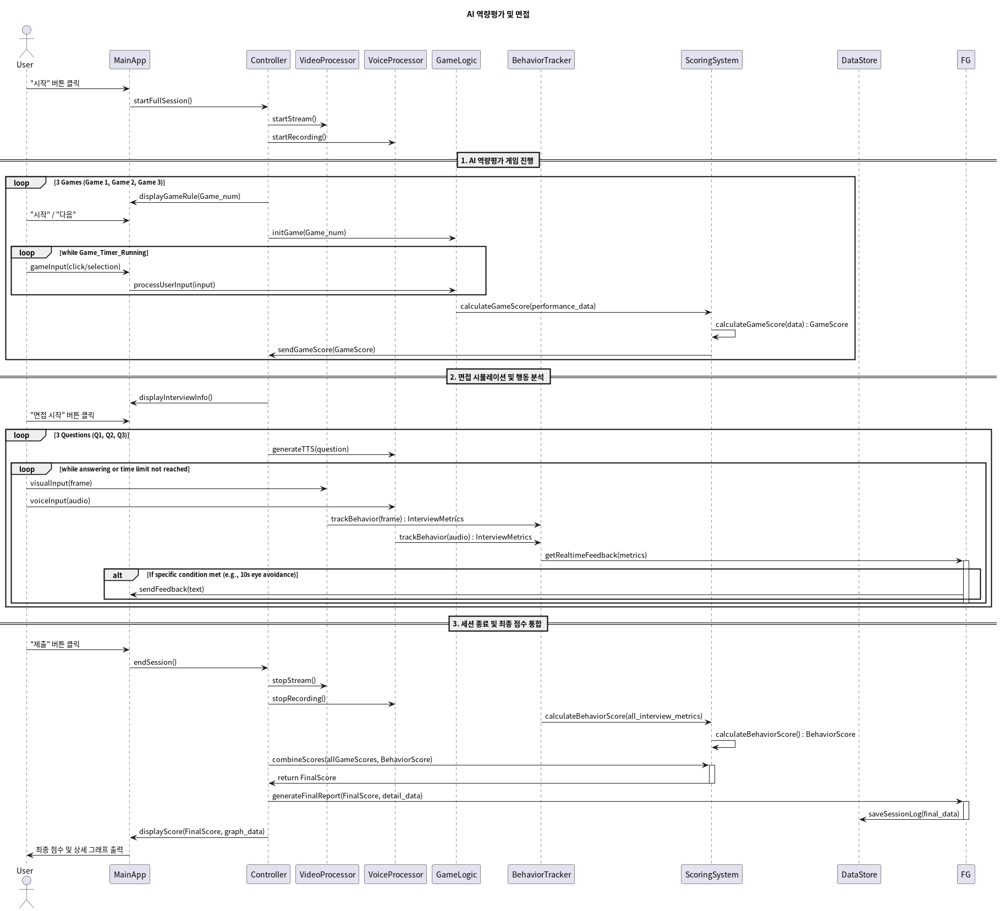

# Project Interview Coach

* 프로젝트 설명: 이 프로젝트는 신경다양인(Neurodivergent individuals)이 면접 상황에서 겪는 비언어적 소통의 어려움을 해소하기 위한 AI 기반 실시간 피드백 훈련 도구입니다.
* 최종 목표: Python을 주력으로 사용하여 웹캠을 통해 사용자의 면접 상황을 분석하고, 시선 회피, 몸 흔들기와 같은 특정 행동을 감지하여 실시간 텍스트 피드백을 제공하는 독립 실행형 GUI 애플리케이션을 구축합니다.

## High Level Design





* (프로젝트 아키텍쳐 기술, 전반적인 diagram 으로 설명을 권장)

## Clone code

* (각 팀에서 프로젝트를 위해 생성한 repository에 대한 code clone 방법에 대해서 기술)

```shell
git clone git@github.com:MinorClass/AI_Project.git
```

## Prerequite

* (프로잭트를 실행하기 위해 필요한 dependencies 및 configuration들이 있다면, 설치 및 설정 방법에 대해 기술)

```shell
python -m venv .venv
source .venv/bin/activate
pip install -r requirements.txt
```

## Steps to build

* (프로젝트를 실행을 위해 빌드 절차 기술)

```shell
cd ~/xxxx
source .venv/bin/activate

make
make install
```

## Steps to run

* (프로젝트 실행방법에 대해서 기술, 특별한 사용방법이 있다면 같이 기술)

```shell
cd ~/xxxx
source .venv/bin/activate

cd /path/to/repo/xxx/
python demo.py -i xxx -m yyy -d zzz
```

## Output

* (프로젝트 실행 화면 캡쳐)


## Appendix

* (참고 자료 및 알아두어야할 사항들 기술)


## Preparation

### Git LFS(Large File System)

* 크기가 큰 바이너리 파일들은 LFS로 관리됩니다.

* git-lfs 설치 전

```shell
# Note bin size is 132 bytes before LFS pull

$ find ./ -iname *.bin|xargs ls -l
-rw-rw-r-- 1 <ID> <GROUP> 132 Nov  6 09:41 ./mosaic-9.bin
-rw-rw-r-- 1 <ID> <GROUP> 132 Nov  6 09:41 ./mosaic-9.bin
-rw-rw-r-- 1 <ID> <GROUP> 132 Nov  6 09:41 ./ssdlite_mobilenet_v2_fp16.bin
-rwxrwxr-x 1 <ID> <GROUP> 132 Nov  6 09:41 ./ssdlite_mobilenet_v2_fp16.bin
```

* git-lfs 설치 후, 다음의 명령어로 전체를 가져 올 수 있습니다.

```shell
$ sudo apt install git-lfs

$ git lfs pull
$ find ./ -iname *.bin|xargs ls -l
-rw-rw-r-- 1 <ID> <GROUP> 3358630 Nov  6 09:41 ./mosaic-9.bin
-rw-rw-r-- 1 <ID> <GROUP> 3358630 Nov  6 09:41 ./mosaic-9.bin
-rw-rw-r-- 1 <ID> <GROUP> 8955146 Nov  6 09:41 ./ssdlite_mobilenet_v2_fp16.bin
-rwxrwxr-x 1 <ID> <GROUP> 8955146 Nov  6 09:41 ./ssdlite_mobilenet_v2_fp16.bin
```

### 환경설정

* [Ubuntu](./doc/environment/ubuntu.md)
* [OpenVINO](./doc/environment/openvino.md)
* [OTX](./doc/environment/otx.md)

### Team: 뭔가 센스있는 팀명
<프로젝트 요약>
* Members
  | Name | Role |
  |----|----|
  | 민해인 | Project lead, 프로젝트를 총괄하고 망하면 책임진다. |
  | 서준희 | Project manager, 마일스톤을 생성하고 프로젝트 이슈 진행상황을 관리한다. |
  | 이승현 | AI modeling, 원하는 결과가 나오도록 AI model을 선택, data 수집,Architect, 프로젝트의 component를 구성하고 상위 디자인을 책임진다.  training을 수행한다. |
  | 이준혁 | UI design, 사용자 인터페이스를 정의하고 구현한다. |
  
* Project Github : https://github.com/MinorClass/AI_Project.git
* 발표자료 : https://github.com/goodsense/project_aewsome/doc/slide.ppt

